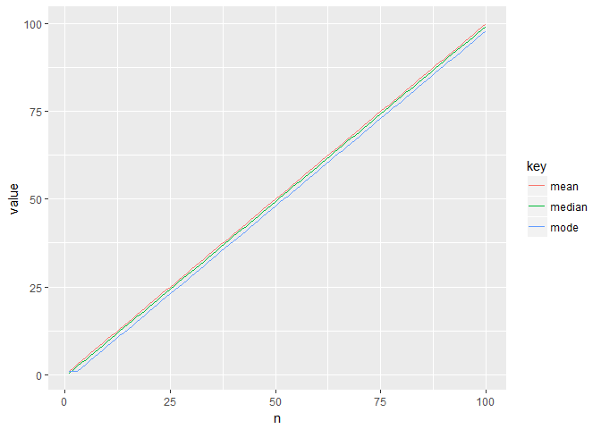

第2章 練習問題
================

第2章の練習問題を解く。

2.1 代表値の間隔
----------------

自由度10のカイ二乗分布で考えてみる。
kはだいたい2くらいの値になる。

``` r
x <- dchisq(1:100, 10)

qchisq(0.5, 10) # 中央値
```

    ## [1] 9.341818

``` r
sum(x * (1:100)) # 平均
```

    ## [1] 9.999995

``` r
grep(max(x), x) # 最頻値 
```

    ## [1] 8

``` r
(qchisq(0.5, 10) - grep(max(x), x)) / (sum(x * (1:100)) - qchisq(0.5, 10))
```

    ## [1] 2.038686

自由度nに対する、カイ二乗分布の中央値、平均、最頻値、およびkを計算する。
どのようなnでも、kは大体2くらいになるようだ。
つまり、「中央値と最頻値の差」は「平均値と中央値の差」の約2倍くらいになる。

``` r
x <- 
  data.frame(n = 1:100) %>% 
  mutate(median = qchisq(0.5, n),
         mean = sapply(n, function(x){sum(dchisq(1:10000, x) * (1:10000))}),
         mode = sapply(n, function(x){grep(max(dchisq(1:10000, x)), dchisq(1:10000, x))}),
         k = (median - mode) / (mean - median))

summary(x$k)
```

    ##    Min. 1st Qu.  Median    Mean 3rd Qu.    Max. 
    ##  -1.166   2.005   2.007   1.970   2.013   2.195

``` r
x %>% 
  select(-k) %>% 
  gather(key, value, -n) %>% 
  ggplot(aes(n, value, col = key)) +
  geom_line()
```


